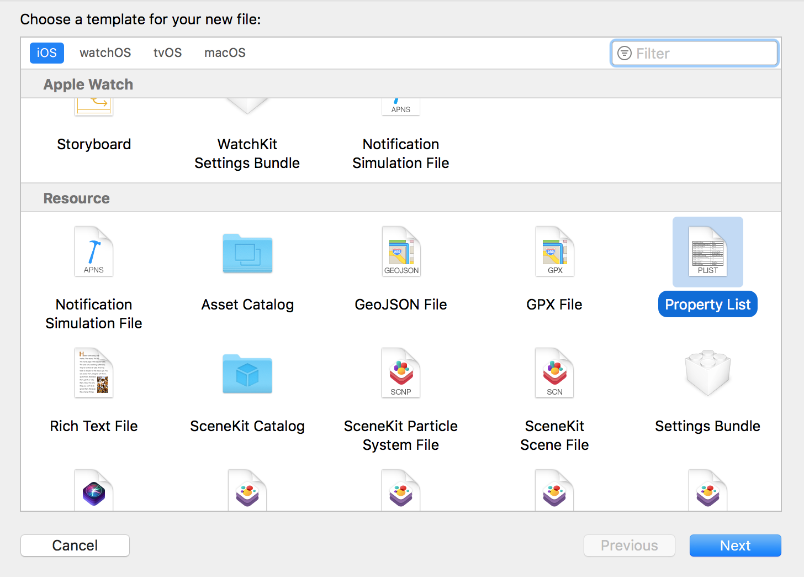
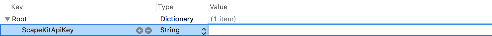

# ScapeKit Samples for iOS

* Clone the repository
* Add `ScapeKitApiKey.plist` to the Xcode project: `File` -> `New` -> `File` -> `Property List`

</a>

* Add `ScapeKitApiKey` as shown below

</a>

* Fill in the empty field with your actual `API_KEY` created on your developer dashboard 

* Now you can deploy the application on your device
